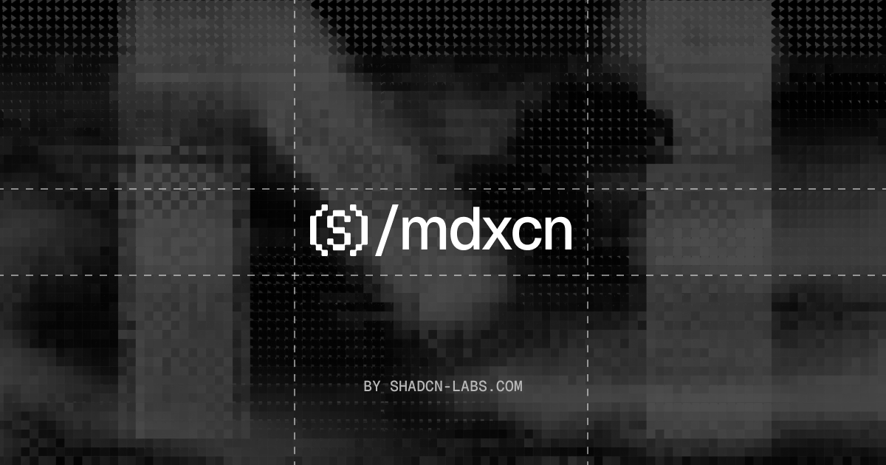

  

<h1 align="center">mdxcn</h1>

  Free & open-source, ready-to-use, customizable Markdown-friendly components for React. 
  Copy the source into your app. Built for <a href="https://mdxcn.dev/docs/mdx">MDX</a>, works seamlessly with <a href="https://ui.shadcn.com/">shadcn/ui</a>.

  
  
  
  

  <a href="https://mdxcn.dev/docs">Get Started</a> ·
  <a href="https://mdxcn.dev/docs/installation">Installation</a> ·
  <a href="https://mdxcn.dev/docs">Components</a>

## Features

- ⚡ **Text-powered figures** — Charts and diagrams drawn with glyphs, not SVG or canvas
- 🎯 **Markdown-first** — Write lists, tables, and emphasis inside component tags
- 👀 **Live previews** — Render every component directly in the documentation
- 🎨 **Fully customizable** — Control corners, glyphs, palettes, and accents
- 📦 **shadcn/ui compatible** — Copy the source with the same registry format and CLI workflow
- 🧩 **Composable** — Use MDX, Comark blocks, or Knap filters with official fenced ASCII for READMEs and PRs
- 🔤 **Type-safe** — React components with TypeScript props

## Community

The mdxcn community lives on [GitHub](https://github.com/shadcn-labs/mdxcn), where you can ask questions, share ideas, and show what you've built.

## Contributing

Contributions are welcome. See [CONTRIBUTING.md](CONTRIBUTING.md) to get the repo running locally and land a change, and use [issues](https://github.com/shadcn-labs/mdxcn/issues) and [discussions](https://github.com/shadcn-labs/mdxcn/discussions) to collaborate. By participating, you agree to the [Code of Conduct](./CODE_OF_CONDUCT.md).

## Security

Please do not open public issues for security vulnerabilities. Follow [SECURITY.md](./SECURITY.md) and report them privately through GitHub Security Advisories.

## License

[MIT](LICENSE)

## Contributors

> Made with [contrib.rocks](https://contrib.rocks)

## Star History

<a href="https://www.star-history.com/?repos=shadcn-labs%2Fmdxcn&type=date&legend=top-left">
 <picture>
   <source media="(prefers-color-scheme: dark)" srcset="https://api.star-history.com/chart?repos=shadcn-labs/mdxcn&type=date&theme=dark&legend=top-left" />
   <source media="(prefers-color-scheme: light)" srcset="https://api.star-history.com/chart?repos=shadcn-labs/mdxcn&type=date&legend=top-left" />
   
 </picture>
</a>
